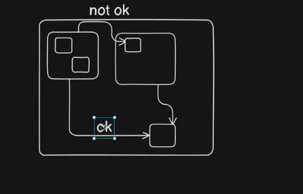

root*project/
run.py->startapp
fn.py->functions
processing/
utils/
**init**.py*>if something has init it is package

Access things only inside your house and things that are in public dont take things from someone's else house
