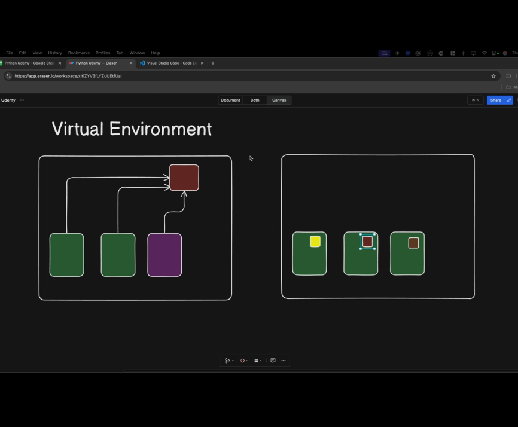

## Does not affect other kind of systems

- When working on python code or any software we bring third party codes too
- If our python code depends on the third party code we can have trouble if the third party changes
- that is why we make virtual environments so that each project/software have their own thing
  
