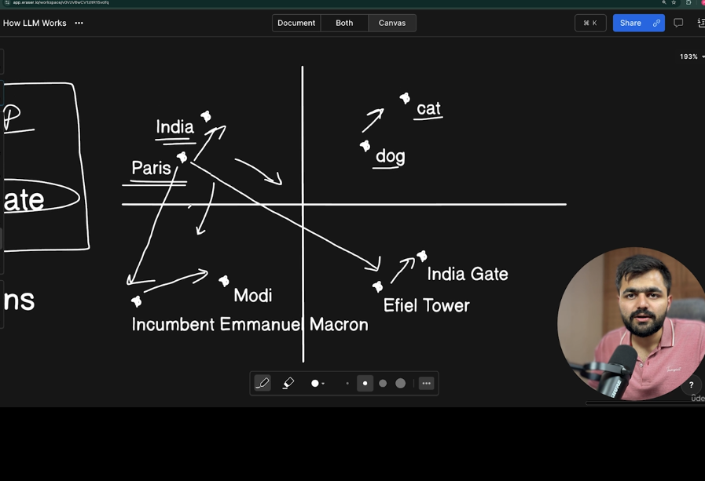
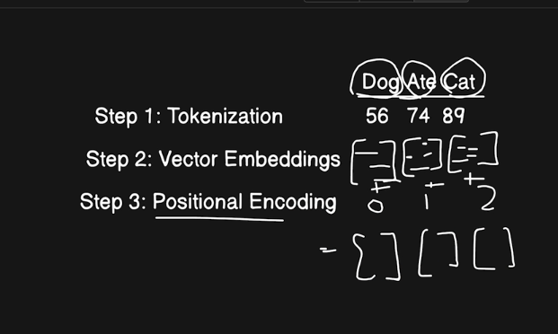

### The dog ate the cat

### The Mobile

### Paris, eiffel, India, India gate

- these are jumbled english alphabets but they carry some meanings
- How do u make the machine understand these meanings
- vector embeddings add semantics to the tokens

- See similar things are in the same direction and to reach the related things we go in the same direction
- They are actually in 3d graph

### Problem with vector embeddings they cannot understand the meaning

- eg dog ate cat
- cat ate dog
  same vector embeddings but they carry diff meanings
- Positional embedding solves by adding the position of tokens
- THen new vector embeddings are generated
  

#### Steps

##### v e =>vector embeddings

- Step 1: Tokenization
- Step 2: Vector embeddings
- Step 3: Positional embeddings
- Step 4: Self attentions ---> talk to each other change their meaning
  eg river bank
  eg icici bank
  river vector embeddings will talk to the ve of bank and change the meaning

### What happens in multi head mechanism

Multti head attention is giving attention to multiple things so that we understand the context better
