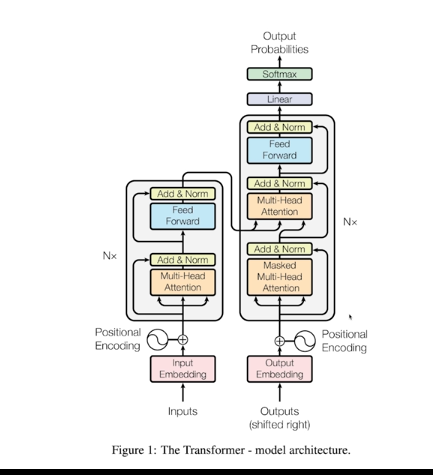
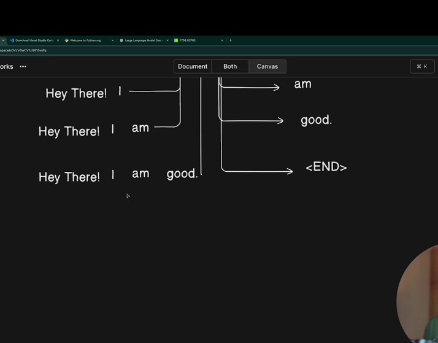
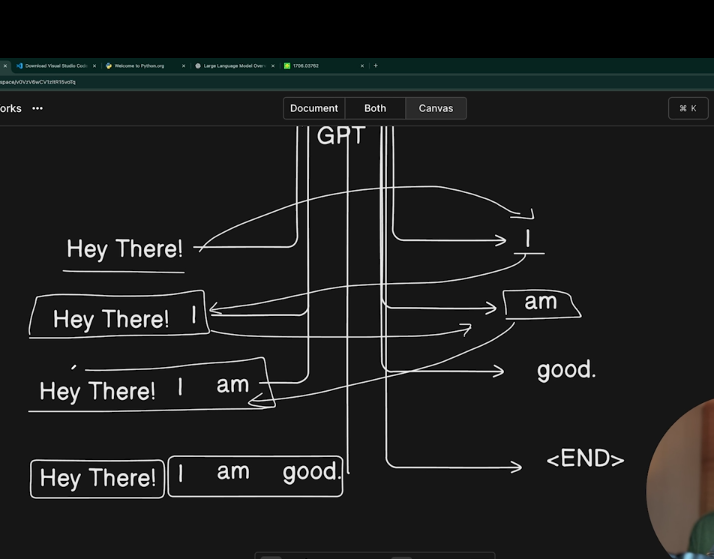

### Transformer

#### Figure of a tranformer

#### Idea behind a transformer

- user will give a input and transformer based on some ml algo generate something

### How gpt is different

- GPT just predicts the next token
- EG input is hey There
- Transformer predicts next token ---> I [that's it]

#### below image shows that transformers only predict the next token

- Predict and append again in the input token
- The prediction is based on ml algos
- This is a very reptitive task and that is why it is cpu heavy requires GPU
