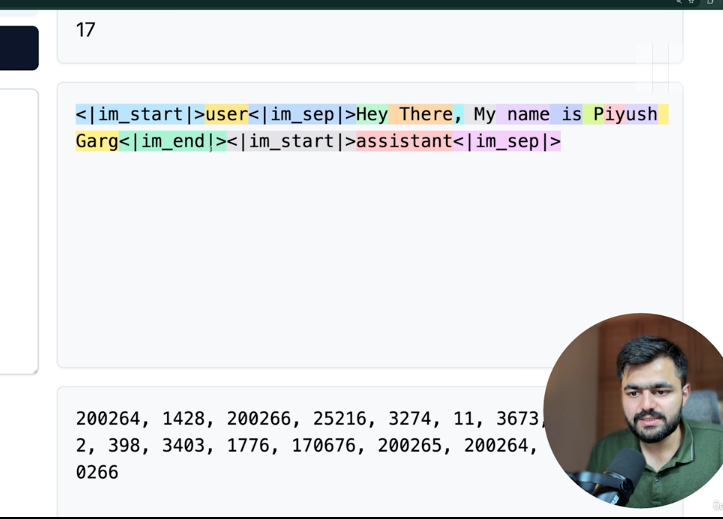

#### What are tokens

A=1
B=2
C=3
D=4
E=5

123====>Transformer====>predict 4

- This is what predictions is
- The chars that humans use are mapped to some numbers known as tokens

All token systems are different

- These are sent as input to transformers and they just predict the next number called the next output token
- Converting the user input to some set of numbers understandable by llms is known as tokenization
- THe llms just predict just predict the next token
- de tokenization also happens to plain english language so that the user understands it back
