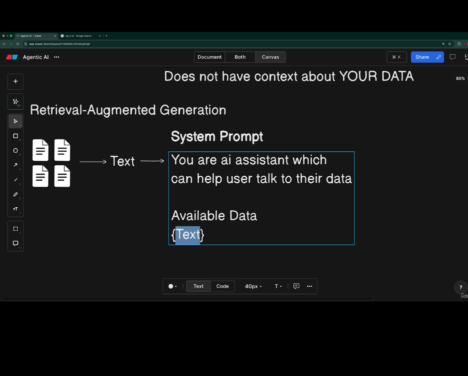
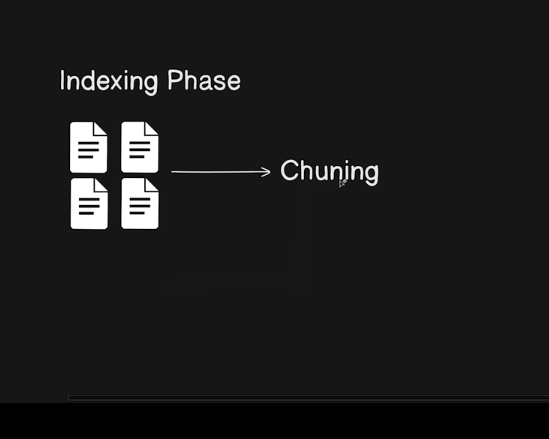
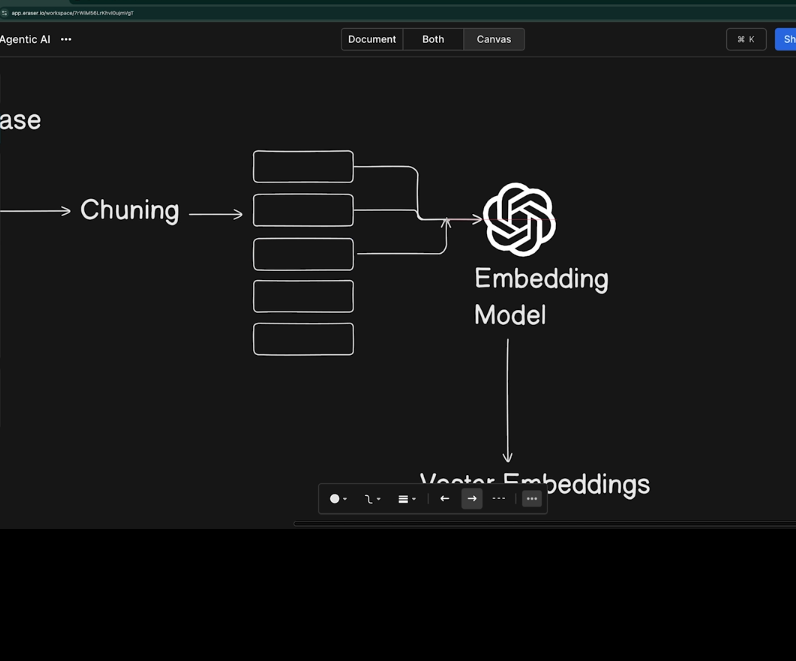
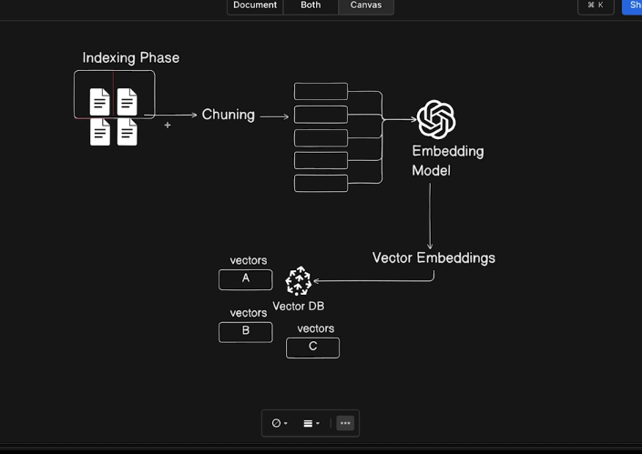
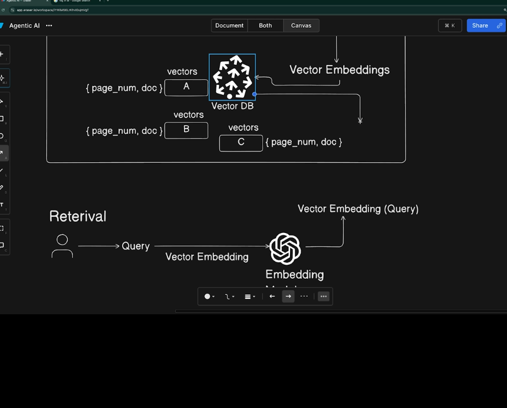

### Naive approach

Basic flow

### Problems with naive approach

- Lot of tokens does cost money
- Context window limited

### Optimization

You have two phases to do RAG

- Indexing Phase- provide data
- Retrieval Phase- chatting with data

### Indexing phase

Chunking can be either page wise or paragraph wise

---

- for every chunk we check what data it holds
- we choose a embedding model
- give chunks to the vector embedding model in a loop
  
- we will have vector databases that store these
- picecode etc
  
- in vector database we store the chunk as well as the embedding(metadata too)
  

### Retrieval Phase

- input is user query or message
- convert these queries to vector embeddings
- u have user qeuries in vector so u do vector similarity search in the vector db and give in return the relevant chunks
  
- in vector db we stored both vectors and chunks too we now concerned with the original content in chunks now take a chat model and pass that content to the model ...refine the ans with the help of the model
